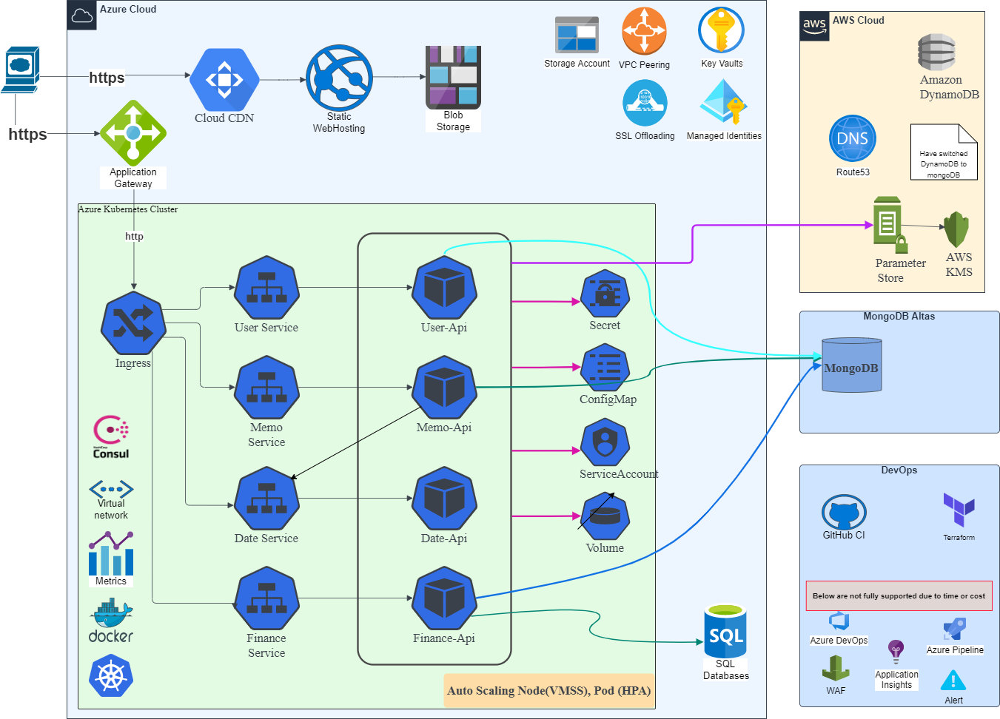

# dlw - daily life web microservices (RESTful)

[](https://github.com/FelixAnna/web-service-dlw/actions?query=branch%3Amaster)
[](https://codecov.io/gh/FelixAnna/web-service-dlw)
[](https://goreportcard.com/report/github.com/FelixAnna/web-service-dlw/src/common)

# Table of Contents

- 1. [Prepare](#prepare)
- 2. [Switch Context](#switch-kubectl-context)

- 3. [Components](#components)
    - 3.1 [Microservices](#microservices)
    - 3.2 [Ingress controller](#ingress)
    - 3.3 [Metric Server](#metric-server)
    - 3.4 [Dashboard](#dashboard)

- 4. [Deployment](#deployments)
    - 4.1 [Helm](#helm-deployments)

- 5. [Target](#target)
    - 5.1 [Kind](#kind)
    - 5.2 [AKS + nginx](#aksnginx)
	- 5.3 [AKS + Application Gateway](#aksappgw)
    
- 6. [Front-end](#front-end)

## Prepare 
1. Register OAuth Apps in https://github.com/settings/developers (2+ for different environment)
   
   the Authorization callback URL should be： {baseApiUrl}/user/oauth2/github/redirect
   
   keep the ClientID and ClientSecret

2. Add parameters in aws parameter store: 
   
   https://ap-southeast-1.console.aws.amazon.com/systems-manager/parameters/?region=ap-southeast-1&tab=Table , 
   
   use KMS customer managed keys if necessary.

3. [deprecated]Create Tables in aws DynamoDB:

   dlf.Memos, dlf.Users
   
4. Prepare an SQL Server instance to store data for finance api, table will be automatic migrated

5. Prepare database in MongoDB atlas (free forever for first 500MB)
	
	* database: dlw_mathematicals
	* collections： answers， questions

	* database: dlw_memo
	* collections： users， memos (replace dynamodb)

## Switch kubectl context

after you connected to aks, you context is attached to aks by default, if you want to check your local kubernetes status, you need switch context:

```bash
kubectl config view
kubectl config use-context kind-dlw-cluster
```

## Components
### Microservices


Service | Path | Tags
--- | --- | ---
User api service | [user api service](/src/user-api/readme.md) | [](https://goreportcard.com/report/github.com/FelixAnna/web-service-dlw/src/user-api)
Memo api service | [memo api service](/src/memo-api/readme.md) | [](https://goreportcard.com/report/github.com/FelixAnna/web-service-dlw/src/memo-api)
Date api service | [date api service](/src/date-api/readme.md) | [](https://goreportcard.com/report/github.com/FelixAnna/web-service-dlw/src/date-api)
Finance api service | [finance api service](/src/finance-api/readme.md) | [](https://goreportcard.com/report/github.com/FelixAnna/web-service-dlw/src/finance-api)

### Helm deployment templetes (autoscaling)

`devops/dlw-chart`: include autoscaling components which only supported by kubectl 1.23+ .

`devops/dlw-chart-nossl`: same as above, except not include cert-manager, ingress with public ip, use this for local development.
### Ingress
reference [ingress](./devops/ingress/readme.md)


### Metric Server
`devops/metrics/*.yaml`: enable metrics server which is necessary for horizontalautoscaler or veticalautoscaler if metric server not deployed by default, --kubelet-insecure-tls args is used for local, --metric-resolution can be set to longer if use docker-desktop

cloud based kubernetes already include metric server by default.

### Dashboard
`devops/dashboard`: follow the instructions to enable dashboard.

## Deployments
### Helm Deployments

#### setup
1. download and unzip helm, add folder to env PATH, following: https://helm.sh/   https://github.com/helm/helm/releases

2. add helm chart repo: https://helm.sh/docs/intro/quickstart/
	```bash
	helm repo add bitnami https://charts.bitnami.com/bitnami
	```
#### deploy
1. update the *awsKeyId* and *awsSecretKey* to correct value in: `devops\dlw-chart\values_*.yaml`
2. cd to `devops` folder, run:
	```bash
	helm install dlw ./dlw-chart/ --namespace dlw-dev --create-namespace  --values ./dlw-chart/values_*.yaml
	```
3. after all resources installed (include ingress controller), access test api from local browser: http://localhost/date/status
4. update by running:
	```bash
	helm upgrade --install dlw ./dlw-chart/ --namespace dlw-dev --values ./dlw-chart/values_*.yaml
	```
5. remove all by running:
	```bash
	helm uninstall dlw -n dlw-dev
	```

## Target

### Kind
`devops/kind/*.yml`: set up kubernetes cluster by using kind, which can run multiple control panel and work nodes by using docker containers in local.

#### Set up kind: 
This version do not contains SSL/TLS termination and https redirection, and use kubernetes service discovery.

[kind/readme.md](devops/kind/readme.md)

#### deployments
install/update/uninstall by following [deploy by helm](#helm-deployments)

### AKS(nginx)
#### install /uninstall

This version contains SSL/TLS termination and https redirection, and use consul service discovery.

following： [./devops/aks_nginx/readme.md](./devops/aks_nginx/readme.md)

refer: [Securing NGINX-ingress](https://cert-manager.io/v0.14-docs/tutorials/acme/ingress/), [Let's Encrypt](https://letsencrypt.org/)

### AKS(appgw)

This version contains SSL/TLS termination and https redirection, and use consul service discovery.

#### install
following： [./devops/aks_appgw/readme.md](./devops/aks_appgw/readme.md)

 refer: [aks](https://docs.microsoft.com/en-us/cli/azure/aks?view=azure-cli-latest#az-aks-create), [application gateway for aks](https://docs.microsoft.com/en-us/azure/application-gateway/tutorial-ingress-controller-add-on-existing#code-try-2),
 [application-gateway-kubernetes-ingress](https://azure.github.io/application-gateway-kubernetes-ingress)

#### deployments
install/update/uninstall by following [deploy by helm](#helm-deployments)

## Front-end
implemented by [ReactJs + Redux](https://github.com/FelixAnna/keep-hands-on/tree/master/important/dlw-app)
