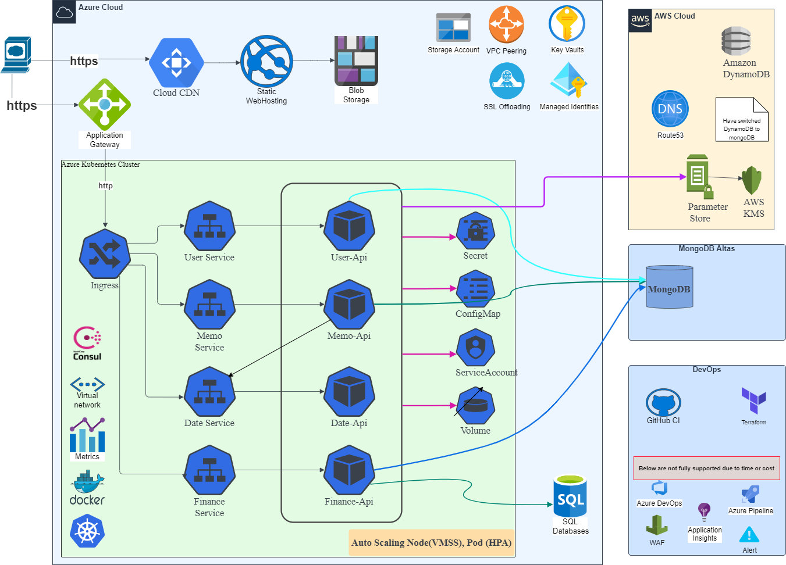

# dlw - daily life web microservices (RESTful)

[](https://github.com/FelixAnna/web-service-dlw/actions?query=branch%3Amaster)
[](https://codecov.io/gh/FelixAnna/web-service-dlw)
[](https://goreportcard.com/report/github.com/FelixAnna/web-service-dlw/src/common)

# Table of Contents

- 1. [Prepare](#prepare)
- 2. [Tools](#tools)
- 3. [Switch Context](#switch-kubectl-context)

- 4. [Components](#components)
    - 4.1 [Microservices](#microservices)
    - 4.2 [Ingress controller](#ingress)
    - 4.3 [Metric Server](#metric-server)
    - 4.4 [Dashboard](#dashboard)

- 5. [DevOps](#devops)
	- 5.1 [Docker build and push](#docker-build--push-to-azure-container-registry)
	- 5.2 [Deploy to AKS with nginx](#aksnginx)
	- 5.3 [Deploy to AKS with application gateway](#aksappgw)
	- 5.4 [Deploy to local Kind cluster](#local-deployment)
    
- 6. [Front-end](#front-end)

## Prepare 
1. Register OAuth Apps in https://github.com/settings/developers (2+ for different environment)
   
   the Authorization callback URL should be： {baseApiUrl}/user/oauth2/github/redirect
   
   keep the ClientID and ClientSecret

2. Add parameters in aws parameter store: 
   
   https://ap-southeast-1.console.aws.amazon.com/systems-manager/parameters/?region=ap-southeast-1&tab=Table , 
   
   use KMS customer managed keys if necessary.

~~3. [deprecated]Create Tables in aws DynamoDB: dlf.Memos, dlf.Users~~
   
4. Prepare an SQL Server instance to store data for finance api, table will be automatic migrated

5. Prepare database in MongoDB atlas (free forever for first 500MB)
	
	* database: dlw_mathematicals
	* collections： answers， questions

	* database: dlw_memo
	* collections： users， memos (replace dynamodb)

## Tools

1. install git: https://git-scm.com/downloads;
2. install \[dotnet 6 sdk\] (https://dotnet.microsoft.com/en-us/download/dotnet/6.0);
3. install [nodejs](https://nodejs.org/en/download/) and [npm](https://www.npmjs.com/package/npm);
4. install and configure [azure cli](https://learn.microsoft.com/en-us/cli/azure/install-azure-cli);
5. install [kubectl](https://kubernetes.io/docs/tasks/tools/);
6. install [helm](https://helm.sh/docs/intro/install/);
7. install [terraform](https://developer.hashicorp.com/terraform/tutorials/aws-get-started/install-cli);
8. install [consul](https://developer.hashicorp.com/consul/downloads?host=www.consul.io).

---

1. \[optional\] install [postman](https://www.postman.com/downloads/);
2. \[optional\] install [draw.io](https://github.com/jgraph/drawio-desktop/releases);
3. \[optional\] install [docker](https://www.docker.com/);
4. \[optional\] install [kind](https://kubernetes.io/docs/tasks/tools/#kind);
5. \[optional\] install and configure [aws cli](https://aws.amazon.com/cli/).


## Switch kubectl context

after you connected to aks, you context is attached to aks by default, if you want to check your local Kubernetes status, you need switch context:

```bash
kubectl config view
kubectl config use-context kind-dlw-cluster
```

## Components
### Microservices 
(Here is the Application Gateway version, Nginx version is very similar)


Service | Path | Tags
--- | --- | ---
User api service | [user api service](/src/user-api/readme.md) | [](https://goreportcard.com/report/github.com/FelixAnna/web-service-dlw/src/user-api)
Memo api service | [memo api service](/src/memo-api/readme.md) | [](https://goreportcard.com/report/github.com/FelixAnna/web-service-dlw/src/memo-api)
Date api service | [date api service](/src/date-api/readme.md) | [](https://goreportcard.com/report/github.com/FelixAnna/web-service-dlw/src/date-api)
Finance api service | [finance api service](/src/finance-api/readme.md) | [](https://goreportcard.com/report/github.com/FelixAnna/web-service-dlw/src/finance-api)

### Ingress
reference [ingress](./devops/ingress/readme.md)

### Metric Server
`devops/metrics/*.yaml`: enable metrics server which is necessary for horizontalautoscaler or veticalautoscaler if metric server not deployed by default, --kubelet-insecure-tls args is used for local, --metric-resolution can be set to longer if use docker-desktop

cloud based kubernetes already include metric server by default.

### Dashboard
`devops/dashboard`: follow the instructions to enable dashboard.

## DevOps

in "devops" folder, you can find how to deploy the microservices to azure Kubernetes service.

microservice helm chart is located in "./dlw-chart" and "./dlw-chart-nossl".

### Docker build & push to azure container registry

```
  ## if you have docker

  tag=latest

  cd src/date-api
  docker build -t dlw-date-api:$tag -f Dockerfile . 
  docker image tag dlw-date-api:$tag hssdevacr.azurecr.io/dlw-date-api:$tag
  docker image push hssdevacr.azurecr.io/dlw-date-api:$tag
  
  cd ../finance-api
  docker build -t dlw-finance-api:$tag -f Dockerfile . 
  docker image tag dlw-finance-api:$tag hssdevacr.azurecr.io/dlw-finance-api:$tag
  docker image push hssdevacr.azurecr.io/dlw-finance-api:$tag

  cd ../memo-api
  docker build -t dlw-memo-api:$tag -f Dockerfile . 
  docker image tag dlw-memo-api:$tag hssdevacr.azurecr.io/dlw-memo-api:$tag
  docker image push hssdevacr.azurecr.io/dlw-memo-api:$tag

  cd ../user-api
  docker build -t dlw-user-api:$tag -f Dockerfile . 
  docker image tag dlw-user-api:$tag hssdevacr.azurecr.io/dlw-user-api:$tag
  docker image push hssdevacr.azurecr.io/dlw-user-api:$tag
```
```
  ## if you do not have docker
    
  tag=latest
  cd src/date-api
  az acr build -t dlw-date-api:$tag -f Dockerfile -r hssdevacr -g configuration-rg .
  cd ../finance-api
  az acr build -t dlw-finance-api:$tag -f Dockerfile -r hssdevacr -g configuration-rg .
  cd ../memo-api
  az acr build -t dlw-memo-api:$tag -f Dockerfile -r hssdevacr -g configuration-rg .
  cd ../user-api
  az acr build -t dlw-user-api:$tag -f Dockerfile -r hssdevacr -g configuration-rg .

 ```

### AKS(nginx)

deploy to aks with "prod" argument will create valid cert by cert-manager, and use consul as service register,

```
## deploy (need AWS CLI configured)
cd aks
sh install.sh prod  ## prod/dev
```

```
## destroy (need AWS CLI configured)
cd aks
sh uninstall.sh prod  ## prod/dev
```

```
## install/upgrade our microservices only (don't need to configure AWS CLI)
cd aks/services
sh main_services.sh prod ## prod/dev
```

following： [./devops/aks_nginx/readme.md](./devops/aks_nginx/readme.md)

refer: [Securing NGINX-ingress](https://cert-manager.io/v0.14-docs/tutorials/acme/ingress/), [Let's Encrypt](https://letsencrypt.org/)

### AKS(appgw)

This version contains SSL/TLS termination and https redirection, and use consul service discovery.

following： [./devops/aks_appgw/readme.md](./devops/aks_appgw/readme.md)

 refer: [aks](https://docs.microsoft.com/en-us/cli/azure/aks?view=azure-cli-latest#az-aks-create), [application gateway for aks](https://docs.microsoft.com/en-us/azure/application-gateway/tutorial-ingress-controller-add-on-existing#code-try-2),
 [application-gateway-kubernetes-ingress](https://azure.github.io/application-gateway-kubernetes-ingress)

### local deployment

There is another folder "./demo-chart-nossl" which is for deploying to a local kind cluster, it doesn't depend on cert-manager, and consul.

follow: [./devops/kind/readme.md](./devops/kind/readme.md)

## Front-end
implemented by [ReactJs + Redux](https://github.com/FelixAnna/keep-hands-on/tree/master/important/dlw-app)